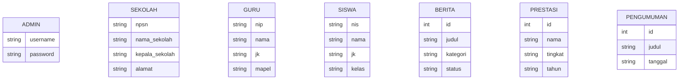

# Perancangan Sistem Informasi Profil Sekolah (Admin Panel)

## 1. Judul Project
Admin Panel / Back-Office Sistem Informasi Profil Sekolah

## 2. Latar Belakang
Sekolah membutuhkan sebuah platform yang modern dan mudah digunakan untuk mengelola data-data yang akan ditampilkan pada website profil utama sekolah (front-end). Sistem manajemen ini dirancang dengan antarmuka yang bersih dan interaktif agar administrator sekolah dapat dengan mudah mengupdate informasi terkini mengenai data sekolah, guru, siswa, serta prestasi dan berita terbaru.

## 3. Tujuan
- Membangun antarmuka administrator yang responsif dan mudah digunakan.
- Menyediakan manajemen konten profil sekolah (CRUD simulation) menggunakan teknologi client-side murni.
- Menerapkan prinsip desain modern (Material Design) untuk fungsionalitas dan estetika.

## 4. Teknologi yang Digunakan
- **HTML5:** Struktur semantik halaman.
- **CSS3 (Custom):** Layout dan styling dengan prinsip Material Design (Flexbox, Grid, CSS Variables).
- **JavaScript (Vanilla JS):** Logika interaktivitas, manipulasi DOM, simulasi auth, dan pengelolaan State (Mock Data).
- **Chart.js:** Visualisasi data untuk halaman dashboard.
- **Font/Icon:** Google Fonts (Inter/Roboto), FontAwesome (Icon).

## 5. Konsep UI Material Design
- **Warna:** Biru (#1976D2) sebagai warna utama, dipadukan dengan putih dan abu-abu (Netral).
- **Elevasi:** Penggunaan drop shadow yang halus pada card dan tombol untuk memisahkan hierarki konten.
- **Tipografi:** Sans-serif modern dengan kontras dan hierarki ukuran yang jelas.
- **Komponen:** Card, Badge (Pill), Flat/Raised Buttons dengan efek ripple (hover/active), dan Form input bergaya Outlined/Underlined.
- **Responsivitas:** Layout akan menyesuaikan diri dengan lebar layar (Desktop, Tablet, Mobile). Sidebar diubah menjadi drawer menu pada layar kecil.

## 6. Struktur Menu/Sidebar
1. Dashboard
2. Profil Sekolah
3. Data Guru
4. Data Siswa
5. Berita
6. Galeri
7. Pengumuman
8. Prestasi
9. Laporan
10. Logout

## 7. User Flow
1. Admin membuka halaman `index.html`.
2. Admin login menggunakan kredensial dummy (admin / admin123).
3. Setelah berhasil, diarahkan ke `dashboard.html`.
4. Admin dapat menavigasi menu melalui Sidebar.
5. Admin dapat menambah, mengedit, atau menghapus data menggunakan fitur Modal dan Form (Simulasi DOM Manipulation).
6. Admin mencetak laporan dari halaman `laporan.html`.
7. Admin klik 'Logout' untuk kembali ke halaman login.

## 8. ERD Sederhana (Mermaid.js)
Meskipun tidak menggunakan database, struktur entitas logika (Mock Data) adalah sebagai berikut:



## 9. Struktur Halaman
- `index.html`: Login Form
- `pages/dashboard.html`: Ringkasan Statistik, Grafik
- `pages/profil-sekolah.html`: Form Detail Sekolah
- `pages/data-guru.html`: Tabel Guru dengan fitur CRUD
- `pages/data-siswa.html`: Tabel Siswa dengan fitur CRUD
- `pages/berita.html`: Tabel Daftar Berita
- `pages/form-berita.html`: Form Tambah/Edit Berita
- `pages/galeri.html`: Grid Foto Galeri
- `pages/pengumuman.html`: Card List Pengumuman
- `pages/prestasi.html`: Tabel Prestasi
- `pages/laporan.html`: Laporan Cetak (Print View)

## 10. Struktur Folder Project
```
project/
├── index.html
├── pages/
│   ├── dashboard.html
│   ├── profil-sekolah.html
│   └── ... (halaman lainnya)
├── assets/
│   ├── css/
│   │   └── style.css
│   ├── js/
│   │   └── script.js
│   └── img/
└── docs/
    └── PERANCANGAN.md
```

## 11. Rencana Mock Data
Data mock akan disimpan dalam bentuk Object/Array JavaScript di dalam `script.js` untuk memudahkan manipulasi DOM pada saat filter, tambah, edit, atau hapus data tabel.

## 12. Link Figma
![Preview Desain UI]
[Link Figma] (https://www.figma.com/design/ff6CepBlkle4b7pkvT5jL8/Untitled?node-id=0-1&t=gWZozlB0NXr41bMY-1)


